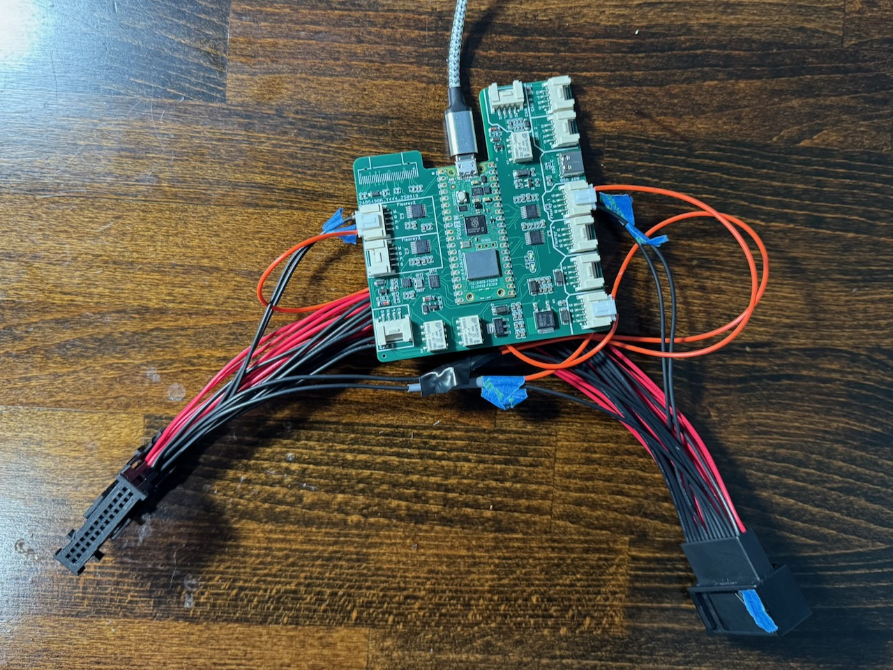
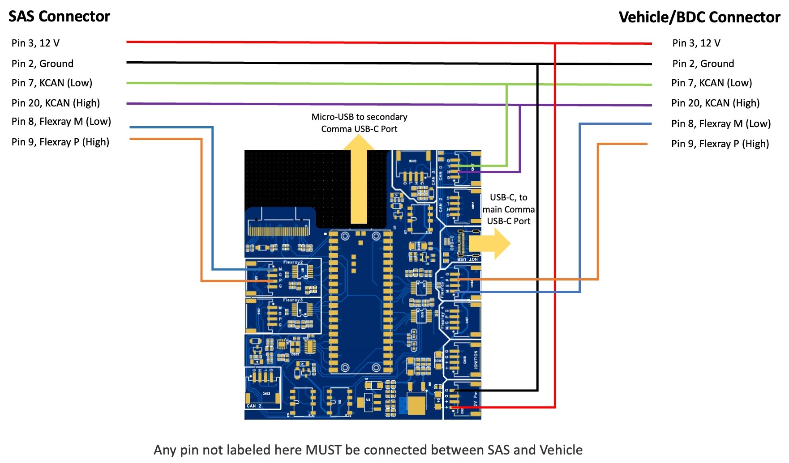

<div align="center" style="text-align: center;">
<h1>openpilot - BMW</h1>

This is a fork of openpilot for BMWs running SP2018. This has been tested on a BMW i4 (G26). 

It uses a Raspberry Pi Pico 2 to intercept flexray data between the SAS and BDC. When receiving steering commands from Openpilot, it injects those commands and sends them to the vehicle.

## Credits

This work heavily leverages the work of [dynm](https://github.com/dynm) and [CzokNorris](https://github.com/CzokNorris). They deserve most of the credit here.

## Warnings

This is a very experimental branch of Sunnypilot, and has not been subjected to the same safety standards as cars supported by Comma.

Ongoing issues:

* Tuning is needed
* I experience steering drop outs every 5-10 minutes.

## Requirements

* BMW running SP2018 (G20, G26, G30, etc). These are cars that advertise having "Driver Assistance Professional" with traffic jam assistant with hands free driving up to 40 MPH. 
* This uses CzokNorris' v1 flexray adapter board. References:
  * [OSHWLab](https://oshwlab.com/czoknorris/v1board)
  * [Schematic](https://github.com/CzokNorris/OpenFSD/tree/main/Hardware/FlexRayRPIPanda/Rev1)
* A Comma 3 (not 3X or 4). I will make a new branch once I get my Comma 4. 

## Making a Harness

You have to make your own harness. The harness sits between the SAS (steering ECU) and Body domain controller (BDC). It is  a 26 pin connector that I purchased from [aliexpress](https://www.aliexpress.us/item/3256805095325163.html?spm=a2g0o.order_list.order_list_main.5.58f31802709VtE&gatewayAdapt=glo2usa). Note that I did have to sand down one of the plastic nubs on the female connector to fit in the SAS. You can purchase these crimped or uncrimped and make your own cable. I purchased them prewired. 



WARNING: This harness picture does not include the CAN going into CAN 0. Make sure yours has this.

Czok's v1 board uses JST HY style connectors. Here are some tips for making them correctly:

- Use 22 gauge silicone wires. This allows for more flexibility and durability. I used - [BNTECHGO 22 Gauge Silicone Wire Kit 10 Color Each 5 ft Flexible 22 AWG Stranded Tinned Copper Wire](https://www.amazon.com/dp/B09X45S4L1?ref=ppx_yo2ov_dt_b_fed_asin_title)
- Make sure to use JST HY 2 mm pitch 4 pin connectors. I bought [CQRobot JST HY 2.0 mm Pitch 4-Pin Electronic Connector IC Male Plugs, Female Sockets Housing and T-Shaped Crimp Terminal Kit. 50 Sets/300 Pieces Wire-to-Board Adapter Cable Assembly.](https://www.amazon.com/dp/B0FCXL4S8P?ref=ppx_yo2ov_dt_b_fed_asin_title)
- Make sure when you crimp that the end of the connector is gripping the silicone shielding
- It helps to have some 20-30 cm of slack between the 26 pin connector and the PCB. THis makes it easier to maneuver the PCB around inside the car during installation.

### Wiring

Its necessary to tap the KCAN line and intercept the flexray data. Here is the wiring:

| Pin           | Label                 | CZ pico board | SAS <-> BDC Passthrough? |
| ------------- | --------------------- | ------------- | ------------------------ |
| 2             | Ground                | U6 G          | Yes                      |
| 3             | 12 V                  | U6 +          | Yes                      |
| 7             | KCAN Low              | Can 0 L       | Yes                      |
| 20            | KCAN High             | CAN 0 H       | Yes                      |
| SAS 8         | SAS Flexray M (low)   | Flexray 2 M   | No                       |
| SAS 9         | SAS Flexray P (high)  | Flexray 2 P   | No                       |
| Vehicle/BDC 8 | Vehicle/BDC Flexray M | Flexray 1 M   | No                       |
| Vehicle/BDC 9 | Vehicle/BDC Flexray P | Flexray 1 P   | No                       |

Any pin not labeled here MUST be connected. There is other data like ethernet that must go between SAS and BDC.

The micro-USB port from the Raspberry Pi pico must go to the Comma secondary USB-C port. The OBD-C connector must go to the Comma main USB-C port. Note that this cable must be a 10 gbps style cable with all internal connectors present.



## Flash Software on the Pico

1. Install the [PICO SDK](https://github.com/raspberrypi/pico-sdk) on your system

2. Make sure the pico is plugged in and run:

   ```
   cd pico-flexray
   mkdir build
   cd build
   export PICO_SDK_PATH=PATH_TO_YOUR_SDK
   cmake -G "Ninja" ..
   ninja
   picotool load -f pico_flexray.uf2
   ```

[See more details at dynm's pico-flexray repo](https://github.com/dynm/pico-flexray).

### Reset to bootloader mode

If you have installed the raspberry pi pico in the car and need to get it back to bootloader mode, run:

```
cd pico-flexray
python3 reset_to_bootloader.py
```

## Installation in Car

This probably only applies to BMW 3 and 4 series (i.e. G20, G26, etc).

- My car is an EV, so it’s **very important** to disconnect the high voltage battery before the 12 V battery. There are instructions how to do this online
- I have a technician guide from BMW on how to replace the SAS if anyone wants it.
- The SAS is in the drivers footwell
- I didn’t fully disconnect the trim piece that is above the pedals, just undid the 2 screws and pulled it out.
  - When this piece is off, the car won’t stay in the “ON” mode if your foot is off the brake
- SAS is held in by 2 bolts. The top one is pretty hard to reach. I managed to get the connector out by disconnecting the bottom bolt only. 
- I placed CZ’s board in an anti-static bag and then left it in the cavity behind the SAS module. Eventually I should secure it to something
- After reconnecting the 12 V then the HV battery, it’s normal to get parking sensor errors but you should not get driver assist errors. The parking sensor errors should go away after a few min of driving.

## Running Sunnypilot

1. Once this is all complete, you will need to flash your Comma with this branch of software. I had issues getting my Comma to clone this repo directly, so you may need to flash it with sunnypilot/master-tici and then manually push this branch via SSH.
2. You will have to manually select your vehicle. Currently supported vehicles are G26 and G30.
3. Run your vehicle with the stock LKAS system disabled, i.e. ACC mode only.

## Other Notes

1. This branch contains a modified version of Cabana that can process flexray data without crashing.
2. With this installation, the comma will only be powered on when the car is powered on.

## Resources

* Dynm: [pico-flexray](https://github.com/dynm/pico-flexray), [sunnypilot fork](https://github.com/dynm/sunnypilot)
* [Guide from Gerico](https://github.com/dynm/pico-flexray/discussions/3)
* Discord:
  * [Openpilot car port](https://discord.com/channels/469524606043160576/1399674371177578516)
  * [Sunnypilot BMW](https://discord.com/channels/880416502577266699/1420418454502113360)


# Openpilot

<p>
  <b>openpilot is an operating system for robotics.</b>
  <br>
  Currently, it upgrades the driver assistance system in 300+ supported cars.
</p>

<h3>
  <a href="https://docs.comma.ai">Docs</a>
  <span> · </span>
  <a href="https://docs.comma.ai/contributing/roadmap/">Roadmap</a>
  <span> · </span>
  <a href="https://github.com/commaai/openpilot/blob/master/docs/CONTRIBUTING.md">Contribute</a>
  <span> · </span>
  <a href="https://discord.comma.ai">Community</a>
  <span> · </span>
  <a href="https://comma.ai/shop">Try it on a comma 3X</a>
</h3>

Quick start: `bash <(curl -fsSL openpilot.comma.ai)`

[](https://github.com/commaai/openpilot/actions/workflows/tests.yaml)
[](LICENSE)
[](https://x.com/comma_ai)
[](https://discord.comma.ai)

</div>

<table>
  <tr>
    <td><a href="https://youtu.be/NmBfgOanCyk" title="Video By Greer Viau"></a></td>
    <td><a href="https://youtu.be/VHKyqZ7t8Gw" title="Video By Logan LeGrand"></a></td>
    <td><a href="https://youtu.be/SUIZYzxtMQs" title="A drive to Taco Bell"></a></td>
  </tr>
</table>


Using openpilot in a car
------

To use openpilot in a car, you need four things:
1. **Supported Device:** a comma 3X, available at [comma.ai/shop](https://comma.ai/shop/comma-3x).
2. **Software:** The setup procedure for the comma 3X allows users to enter a URL for custom software. Use the URL `openpilot.comma.ai` to install the release version.
3. **Supported Car:** Ensure that you have one of [the 275+ supported cars](docs/CARS.md).
4. **Car Harness:** You will also need a [car harness](https://comma.ai/shop/car-harness) to connect your comma 3X to your car.

We have detailed instructions for [how to install the harness and device in a car](https://comma.ai/setup). Note that it's possible to run openpilot on [other hardware](https://blog.comma.ai/self-driving-car-for-free/), although it's not plug-and-play.


### Branches

Running `master` and other branches directly is supported, but it's recommended to run one of the following prebuilt branches:

| comma four branch      | comma 3X branch        | URL                                    | description                                                                         |
|------------------------|------------------------|----------------------------------------|-------------------------------------------------------------------------------------|
| `release-mici`         | `release-tizi`         | openpilot.comma.ai                     | This is openpilot's release branch.                                                 |
| `release-mici-staging` | `release-tizi-staging` | openpilot-test.comma.ai                | This is the staging branch for releases. Use it to get new releases slightly early. |
| `nightly`              | `nightly`              | openpilot-nightly.comma.ai             | This is the bleeding edge development branch. Do not expect this to be stable.      |
| `nightly-dev`          | `nightly-dev`          | installer.comma.ai/commaai/nightly-dev | Same as nightly, but includes experimental development features for some cars.      |

To start developing openpilot
------

openpilot is developed by [comma](https://comma.ai/) and by users like you. We welcome both pull requests and issues on [GitHub](http://github.com/commaai/openpilot).

* Join the [community Discord](https://discord.comma.ai)
* Check out [the contributing docs](docs/CONTRIBUTING.md)
* Check out the [openpilot tools](tools/)
* Code documentation lives at https://docs.comma.ai
* Information about running openpilot lives on the [community wiki](https://github.com/commaai/openpilot/wiki)

Want to get paid to work on openpilot? [comma is hiring](https://comma.ai/jobs#open-positions) and offers lots of [bounties](https://comma.ai/bounties) for external contributors.

Safety and Testing
----

* openpilot observes [ISO26262](https://en.wikipedia.org/wiki/ISO_26262) guidelines, see [SAFETY.md](docs/SAFETY.md) for more details.
* openpilot has software-in-the-loop [tests](.github/workflows/tests.yaml) that run on every commit.
* The code enforcing the safety model lives in panda and is written in C, see [code rigor](https://github.com/commaai/panda#code-rigor) for more details.
* panda has software-in-the-loop [safety tests](https://github.com/commaai/panda/tree/master/tests/safety).
* Internally, we have a hardware-in-the-loop Jenkins test suite that builds and unit tests the various processes.
* panda has additional hardware-in-the-loop [tests](https://github.com/commaai/panda/blob/master/Jenkinsfile).
* We run the latest openpilot in a testing closet containing 10 comma devices continuously replaying routes.

<details>
<summary>MIT Licensed</summary>

openpilot is released under the MIT license. Some parts of the software are released under other licenses as specified.

Any user of this software shall indemnify and hold harmless Comma.ai, Inc. and its directors, officers, employees, agents, stockholders, affiliates, subcontractors and customers from and against all allegations, claims, actions, suits, demands, damages, liabilities, obligations, losses, settlements, judgments, costs and expenses (including without limitation attorneys’ fees and costs) which arise out of, relate to or result from any use of this software by user.

**THIS IS ALPHA QUALITY SOFTWARE FOR RESEARCH PURPOSES ONLY. THIS IS NOT A PRODUCT.
YOU ARE RESPONSIBLE FOR COMPLYING WITH LOCAL LAWS AND REGULATIONS.
NO WARRANTY EXPRESSED OR IMPLIED.**
</details>

<details>
<summary>User Data and comma Account</summary>

By default, openpilot uploads the driving data to our servers. You can also access your data through [comma connect](https://connect.comma.ai/). We use your data to train better models and improve openpilot for everyone.

openpilot is open source software: the user is free to disable data collection if they wish to do so.

openpilot logs the road-facing cameras, CAN, GPS, IMU, magnetometer, thermal sensors, crashes, and operating system logs.
The driver-facing camera and microphone are only logged if you explicitly opt-in in settings.

By using openpilot, you agree to [our Privacy Policy](https://comma.ai/privacy). You understand that use of this software or its related services will generate certain types of user data, which may be logged and stored at the sole discretion of comma. By accepting this agreement, you grant an irrevocable, perpetual, worldwide right to comma for the use of this data.
</details>
